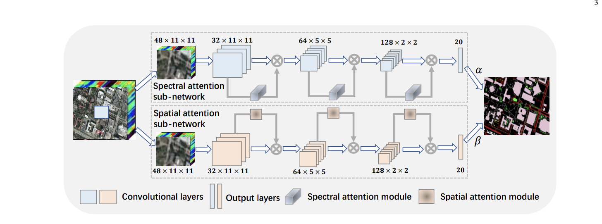

DeepTreeAttention
==============================

[](https://github.com/Weecology/DeepTreeAttention/actions/)

Tree Species Prediction for the National Ecological Observatory Network (NEON)

Implementation of Hang et al. 2020 [Hyperspectral Image Classification with Attention Aided CNNs](https://arxiv.org/abs/2005.11977) for tree species prediction.

# Model Architecture



## Road map ([see V1.0 milestone](https://github.com/weecology/DeepTreeAttention/milestone/1))

- [X] Data Generation: Convert NEON field data into crowns -> pixels for mapping
- [ ] Baseline Model: A vanilla 2D CNN score for computing comet environment, metrics and figures
- [ ] 3D CNN with Attention

After this there are many different routes including weak label learning, self-supervised contrastive learning and other psuedo-labeling approaches

Project Organization
------------

    ├── LICENSE
    ├── README.md          <- The top-level README for developers using this project.
    ├── data
    │   ├── processed      <- The final, canonical data sets for modeling.
    │   └── raw            <- The original, immutable data dump.
    │
    ├── environment.yml   <- Conda requirements
    │
    ├── setup.py           <- makes project pip installable (pip install -e .) so src can be imported
    ├── src                <- Source code for use in this project.
    │   ├── __init__.py    <- Makes src a Python module
    │   ├── data           <- Pytorch Lighting data module for creating dataloaders for model training
    │   ├── dataset        <- Pytorch dataset for generating batches of data
    │   ├── generate       <- Convert csv of point files to tree crowns
    │   ├── main           <- Pytorch Lightning Module for model training
    │   ├── neon_paths     <- Utilities for getting paths and metadata from NEON HSI data
    │   ├── patches        <- Convert tree crowns into a set of pixels with overlapping windows
    │   ├── start_cluster  <- dask utilities for SLURM parallel processingt


--------

# Pytorch Lightning Data Module (data.TreeData)

This repo contains a pytorch lightning data module for reproducibility. The goal of the project is to make it easy to share with others within our research group, but we welcome contributions from outside the community. While all data is public, it is VERY large (>20TB) and cannot be easily shared. If you want to reproduce this work, you will need to download the majority of NEON's camera, HSI and CHM data and change the paths in the config file. For the 'raw' NEON tree stem data see data/raw/neon_vst_2021.csv. The data module starts from this state, which are x,y locations for each tree. It then performs the following actions.

1. Filters the data to represent trees over 3m with sufficient number of training samples
2. Extract the LiDAR derived canopy height and compares it to the field measured height. Trees that are below the canopy are excluded based on the min_CHM_diff parameter in the config.
3. Splits the training and test x,y data such that field plots are either in training or test.
4. For each x,y location the crown is predicted by our tree detection algorithm (DeepForest - https://deepforest.readthedocs.io/).
5. Crops of each tree are created and divided into pixel windows for pixel-level prediction.

<p><small>Project based on the <a target="_blank" href="https://drivendata.github.io/cookiecutter-data-science/">cookiecutter data science project template</a>. #cookiecutterdatascience</small></p>

# Pytorch Lightning Training Module (data.TreeModel)

Training is handled by the TreeModel class which loads a model from the models/ folder, reads the config file and runs the training. The evaluation metrics and images are computed and put of the comet dashboard

## Evaluation metrics

The training metrics are computed at the pixel level during training. At the end of training, predictions are made for each crown using majority rule among pixels. The crown-level accuracy is then computed across classes.

# Dev Guide

In general, major changes or improvements should be made on a new git branch. Only core improvements should be made on the main branch. If a change leads to higher scores, please create a pull request.

## Model Architectures

The TreeModel class takes in a create model function

```
m = main.TreeModel(model=Hang2020.vanilla_CNN)
```

Any model can be specified provided it follows the following input and output arguments

```
class myModel(Module):
    """
    Model description
    """
    def __init__(self, bands, classes):
        super(myModel, self).__init__()
        <define model architecture here>

    def forward(self, x):
        <forward method for computing loss goes here>
        class_scores = F.softmax(x)
        
        return class_scores
```
